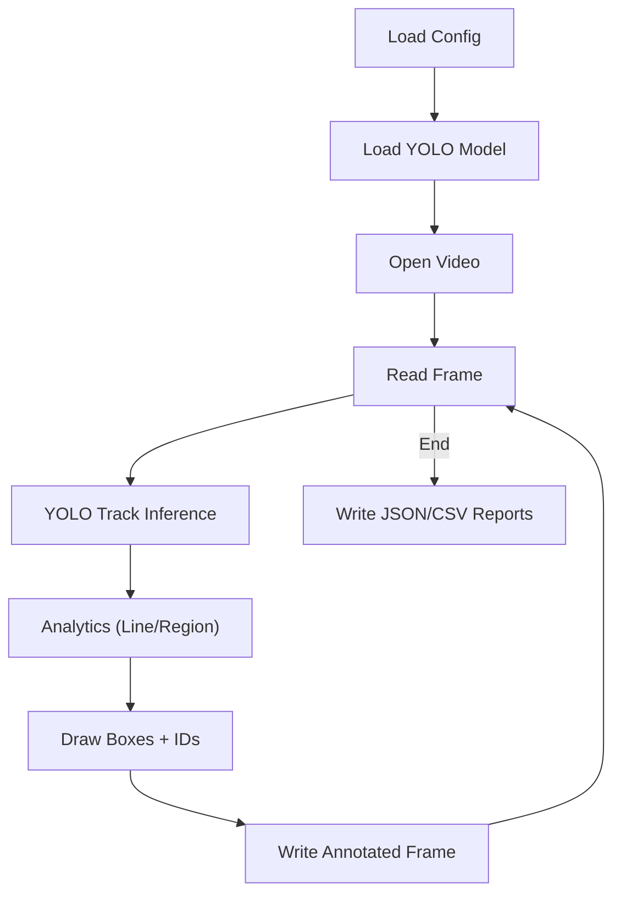

# VTrack - Vision Track

Python-based video inference pipeline using YOLO for object detection. The system processes video frame-by-frame, generates annotated video output, and can optionally run line-crossing and region-presence analytics.

## Project Structure

```
VTrack/
├── main.py
├── config.yaml
├── pyproject.toml
├── requirements.txt
├── core/
│   ├── detector.py
│   ├── video_processor.py
│   ├── feature_base.py
│   ├── line_cross.py
│   └── region_presence.py
├── utils/
│   ├── geometry.py
│   └── roi_editor.py
├── tests/
│   ├── conftest.py
│   ├── test_geometry.py
│   ├── test_line_cross.py
│   ├── test_main_build_features.py
│   └── test_region_presence.py
└── outputs/
```

## How To Run

1. Edit [config.yaml](config.yaml) for your input video and model weights.

2. Run with uv:

```
uv venv
uv sync
uv run -- python main.py
```

Alternative (pip):

```
pip install -r requirements.txt
python main.py
```

Outputs:
- Annotated video: `outputs/annotated.mp4`
If line-crossing is enabled:
- Summary JSON: `outputs/line_1_summary.json`
- Events CSV: `outputs/line_1_events.csv`
If region presence is enabled:
- Summary JSON: `outputs/<region_name>_summary.json`

Optional realtime preview (press `q` to stop) can be enabled in [config.yaml](config.yaml):

```
preview:
  enabled: true
  scale: 0.5
```

Optional ROI setup (click to draw line/region on the first frame) can be enabled in [config.yaml](config.yaml):

```
roi:
  setup_on_start: true
```

ROI shortcuts:
- Line: left click point A then B, Enter/Space to confirm
- Region: left click add vertex (>=3), right click undo, Enter/Space to confirm
- R: reset, Q/Esc: cancel

## Analytics Feature: Line Crossing

Enable line crossing by adding `linecross` to `feature` and providing `lines` in [config.yaml](config.yaml). Coordinates can be normalized (0-1) or pixel-based. The feature uses tracking IDs from ByteTrack to avoid double counting.

## Analytics Feature: Region Presence

Enable region presence by adding `regionpresence` to `feature` and providing `regions` in [config.yaml](config.yaml). Each region is a polygon (3+ points). The feature counts how many objects are inside the polygon for the current frame.

## Configuration

Example [config.yaml](config.yaml):

```
input_video: "data/input.mp4"
output_dir: "outputs"
output_video: "annotated.mp4"

model:
  weights: "models/yolo11n.pt"
  backend: "ultralytics"
  device: "cpu"
  conf: 0.25
  iou: 0.45
  classes: [0]
  tracker: "bytetrack.yaml"

feature:
  - linecross
  - regionpresence
lines:
  - id: 1
    bidirectional: true
    orientation: horizontal
    direction: downward
    coords:
      - x: 0.29375
        y: 0.441667
      - x: 0.75
        y: 0.454167

regions:
  - id: 1
    name: "waiting_area"
    coords:
      - x: 0.12
        y: 0.62
      - x: 0.36
        y: 0.62
      - x: 0.45
        y: 0.95
      - x: 0.08
        y: 0.95

OpenVINO backend (IR model):

```
model:
  weights: "models/best.xml"
  backend: "openvino"
  device: "cpu"
```

Notes:
- OpenVINO uses the .xml file; the matching .bin must be alongside it.
- Install runtime if needed: `pip install openvino`.
- OpenVINO device examples: `CPU`, `GPU`, `AUTO`, `AUTO:GPU,CPU`.
- Ultralytics device examples: `cpu`, `0`, `cuda:0`.
```

## System Flowchart
If this diagram is blank on GitHub, enable Mermaid rendering in the repository settings.


## Notes

- Line crossing relies on tracking IDs (ByteTrack). If IDs are missing, counts may be skipped.
- Region presence uses bbox centers for point-in-polygon checks.
- Supported input formats include common video types such as .mp4 and .avi.
- The pipeline is object-oriented and keeps detection, analytics, and video processing separated for clarity.
- OpenVINO models require the .xml and .bin pair; metadata files are ignored by this app.

## Security

- Treat config files, model weights, and input videos as trusted. Do not run untrusted weights.
- Output paths come from config and are written directly to disk; avoid running with elevated permissions.
- If you need to run untrusted assets, use a sandboxed environment or a restricted output directory.

