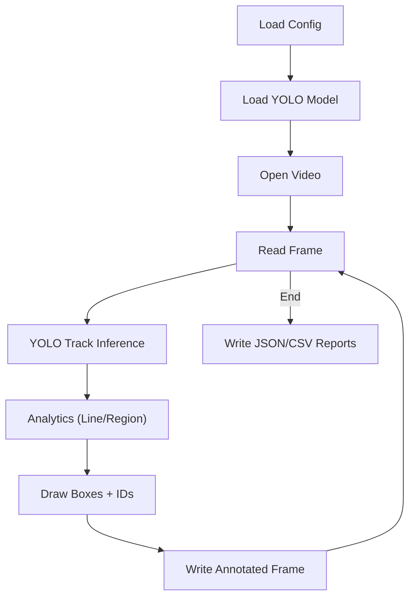

# VTrack - Vision Track


Python-based computer vision engine for video analysis using YOLO object detection, ByteTrack identity tracking, and configurable analytics features (line crossing, region presence). The system processes video frame-by-frame, performs inference, extracts insights, and produces structured data reports along with annotated video output.

## Core Capabilities

- **Frame-by-frame video processing** (.mp4, .avi, etc.)
- **YOLO-based object detection** with Ultralytics or OpenVINO backend
- **ByteTrack object identity tracking** to maintain object continuity across frames
- **Line Crossing analytics** (direction-aware, bidirectional support)
- **Region Presence analytics** (polygon-based with optional dwell-time alerting)
- **Annotated video output** with bounding boxes, tracking IDs, and insight annotations
- **Structured JSON & CSV reports** for event logging and analysis
- **Unit-tested geometry and feature logic** for deterministic behavior

## What's New in v2.0.0

- **Region Presence Analytics**: Count objects inside polygons.
- **Interactive ROI Editor**: Draw lines/regions on first frame.
- **OpenVINO Backend**: Support for `.xml/.bin` quantized models.
- **Unit Tests**: pytest suite for core logic validation.

## Design Principles

**Separation of Concerns**: Detection, tracking, analytics, and geometry logic are isolated to reduce coupling and enable independent evolution.

**Feature Abstraction**: All analytics features inherit from a base feature interface (`feature_base.py`). New analytics can be added without modifying the core pipeline.

**Config-Driven Behavior**: Feature activation and spatial definitions (lines, regions) are fully controlled via `config.yaml`.

**Testability & Determinism**: Geometry and feature logic are independently unit-tested to ensure reliable, predictable behavior.

**Backend Flexibility**: Supports both Ultralytics (.pt) and OpenVINO (.xml/.bin) inference backends without hardcoding dependencies.

## Project Structure

```
VTrack/
├── main.py
├── config.yaml
├── pyproject.toml
├── requirements.txt
├── core/
│   ├── detector.py
│   ├── video_processor.py
│   ├── feature_base.py
│   ├── line_cross.py
│   └── region_presence.py
├── utils/
│   ├── geometry.py
│   └── roi_editor.py
├── tests/
│   ├── conftest.py
│   ├── test_geometry.py
│   ├── test_line_cross.py
│   ├── test_main_build_features.py
│   └── test_region_presence.py
└── outputs/
```

Folder notes:
- data/: place input videos here (default `input_video` path).
- models/: place model weights here (`.pt` or OpenVINO `.xml/.bin`).
- outputs/: generated annotated videos and analytics reports.

## How To Run

1. Edit [config.yaml](config.yaml) for your input video and model weights.

2. Run with uv:

```
uv venv
uv sync
uv run -- python main.py
```

Optional: activate the venv (if you want to run Python directly):

Windows PowerShell:

```
\.venv\Scripts\Activate.ps1
```

Linux/WSL/macOS:

```
source .venv/bin/activate
```

Alternative (pip):

```
pip install -r requirements.txt
python main.py
```

Outputs:
- Annotated video: `outputs/annotated.mp4`
If line-crossing is enabled:
- Summary JSON: `outputs/line_1_summary.json`
- Events CSV: `outputs/line_1_events.csv`
If region presence is enabled:
- Summary JSON: `outputs/<region_name>_summary.json`

Optional realtime preview (press `q` to stop) can be enabled in [config.yaml](config.yaml):

```
preview:
  enabled: true
  scale: 0.5
```

Optional ROI setup (click to draw line/region on the first frame) can be enabled in [config.yaml](config.yaml):

```
roi:
  setup_on_start: true
```

ROI shortcuts:
- Line: left click point A then B, Enter/Space to confirm
- Region: left click add vertex (>=3), right click undo, Enter/Space to confirm
- R: reset, Q/Esc: cancel

Feature selection notes:
- Set `feature: []` (or omit `feature`) to disable analytics and skip ROI setup.
- Use `feature: [linecross]` to enable line crossing and draw/provide `lines`.
- Use `feature: [regionpresence]` to enable region presence and draw/provide `regions`.
- Include both to run both analytics at the same time.

## Analytics Feature: Line Crossing

Enable line crossing by adding `linecross` to `feature` and providing `lines` in [config.yaml](config.yaml). Coordinates can be normalized (0-1) or pixel-based. The feature uses tracking IDs from ByteTrack to avoid double counting.

**Logic Assumption**: A crossing event is triggered when a tracked object's relative position to a defined line changes sign between consecutive frames. The object's center point is used as its spatial anchor. Each track ID is monitored persistently to prevent duplicate event counting.

Notes:
- `direction` and `orientation` are optional; if not set, they are `null` in the summary.
- `bidirectional` defaults to `true` when omitted.

## Analytics Feature: Region Presence

Enable region presence by adding `regionpresence` to `feature` and providing `regions` in [config.yaml](config.yaml). Each region is a polygon (3+ points). The feature counts how many objects are inside the polygon for the current frame.

**Logic Assumption**: An object is considered to be present in a region when its bounding box center lies inside the defined polygon. The point-in-polygon algorithm is used to determine inclusion. Optional dwell-time threshold alerts when a tracked object stays inside the region longer than a specified duration.

Optional dwell time alert: set `dwell_threshold_sec` in a region to emit an alert when a tracked object stays inside the region longer than the threshold. Alerts are exported to `outputs/<region_name>_dwell_events.csv`.

## Configuration

Example [config.yaml](config.yaml):

```
input_video: "data/input.mp4"
output_dir: "outputs"
output_video: "annotated.mp4"

model:
  weights: "models/yolo11n.pt"
  backend: "ultralytics"
  device: "cpu"
  conf: 0.25
  iou: 0.45
  classes: [0]
  tracker: "bytetrack.yaml"

feature:
  - linecross
  - regionpresence
lines:
  - id: 1
    bidirectional: true
    orientation: horizontal
    direction: downward
    coords:
      - x: 0.29375
        y: 0.441667
      - x: 0.75
        y: 0.454167

regions:
  - id: 1
    name: "waiting_area"
    dwell_threshold_sec: 5
    coords:
      - x: 0.12
        y: 0.62
      - x: 0.36
        y: 0.62
      - x: 0.45
        y: 0.95
      - x: 0.08
        y: 0.95

OpenVINO backend (IR model):

```
model:
  weights: "models/best.xml"
  backend: "openvino"
  device: "cpu"
```

Notes:
- OpenVINO uses the .xml file; the matching .bin must be alongside it.
- Install runtime if needed: `pip install openvino`.
- OpenVINO device examples: `CPU`, `GPU`, `AUTO`, `AUTO:GPU,CPU`.
- Ultralytics device examples: `cpu`, `0`, `cuda:0`.
```

## System Flowchart
If this diagram is blank on GitHub, enable Mermaid rendering in the repository settings.


## Notes

- Line crossing relies on tracking IDs (ByteTrack). If IDs are missing, counts may be skipped.
- Region presence uses bbox centers for point-in-polygon checks.
- Supported input formats include common video types such as .mp4 and .avi.
- The pipeline is object-oriented and keeps detection, analytics, and video processing separated for clarity.
- OpenVINO models require the .xml and .bin pair; metadata files are ignored by this app.

## Testing

Run the unit test suite to validate geometry and feature logic:

```
pytest
```

Test coverage includes:
- **Geometry calculations**: Line intersection, point-in-polygon, coordinate transformations
- **Line crossing logic**: Detection of sign changes, edge cases with bidirectional mode
- **Region inclusion logic**: Polygon boundary tests, multi-region overlap scenarios
- **Feature builder logic**: Correct feature instantiation and isolation

Unit tests ensure analytics reliability and deterministic behavior across different input scenarios.

## Security

- Treat config files, model weights, and input videos as trusted. Do not run untrusted weights.
- Output paths come from config and are written directly to disk; avoid running with elevated permissions.
- If you need to run untrusted assets, use a sandboxed environment or a restricted output directory.

